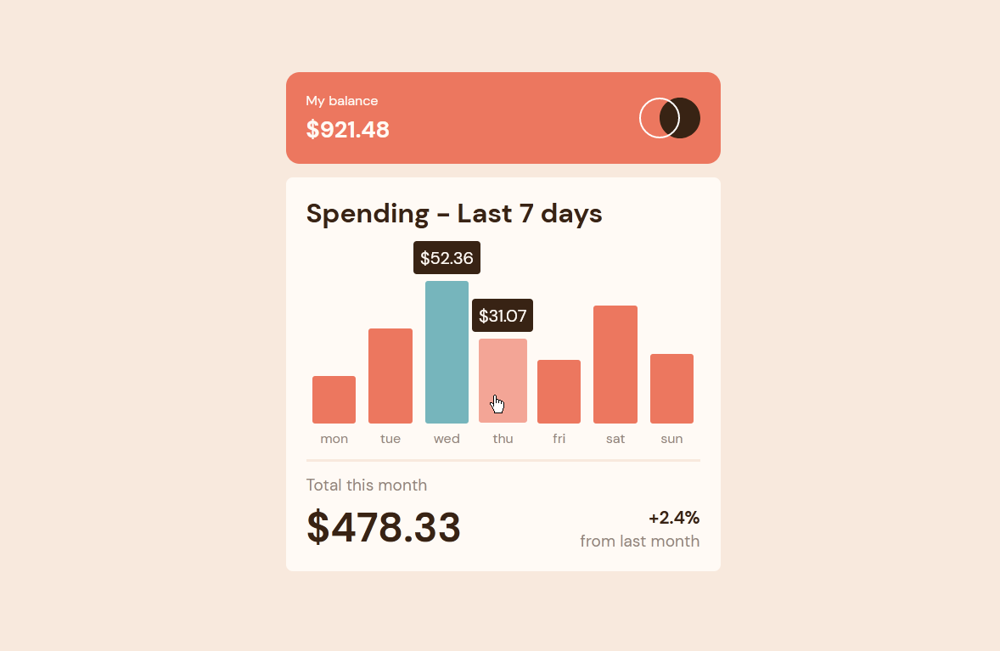
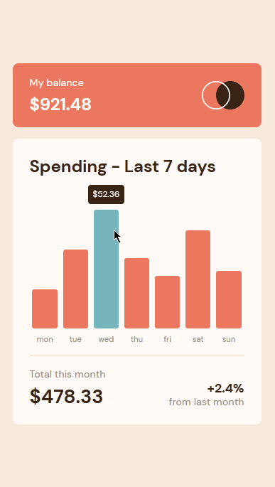

# Frontend Mentor - Expenses chart component

## Welcome! 👋

Thanks for checking out this front-end coding challenge.

[Frontend Mentor](https://www.frontendmentor.io) challenges help you improve your coding skills by building realistic projects.

**To do this challenge, you need a decent understanding of HTML, CSS and JavaScript.**

## The challenge

Your challenge is to build out this bar chart component and get it looking as close to the design as possible.

You can use any tools you like to help you complete the challenge. So if you've got something you'd like to practice, feel free to give it a go.

We provide the data for the chart in a local `data.json` file. So you can use that to dynamically add the bars if you choose.

Your users should be able to:

- View the bar chart and hover over the individual bars to see the correct amounts for each day
- See the current day's bar highlighted in a different colour to the other bars
- View the optimal layout for the content depending on their device's screen size
- See hover states for all interactive elements on the page
- **Bonus**: See dynamically generated bars based on the data provided in the local JSON file

Want some support on the challenge? [Join our Slack community](https://www.frontendmentor.io/slack) and ask questions in the **#help** channel.

## Table of contents

- [Overview](#overview)
  - [Screenshot](#screenshot)
  - [Links](#links)
- [My process](#my-process)
  - [Built with](#built-with)
  - [What I learned](#what-i-learned)
  - [Continued development](#continued-development)
  - [Useful resources](#useful-resources)
- [Author](#author)

## Overview

### Screenshot

### Links

- Source Code URL: [Source Github](https://github.com/lenez12/expenses-chart-component-main.git)
- Live Site URL: [Demo Live](https://lenez-chart-expenses.netlify.app/)

## My process

### Built with

- Semantic HTML5 markup
- CSS custom properties
- Flexbox
- Grid CSS
- SCSS
- CSS5 Animation

### What I learned

what I learned in making this challenge is:

1. using grid css for layouting content
2. i user media Query to build responsive for mobile combinating with grid css
3. using animation
4. get data using fetch
5. manipulate dom

### Continued development

1. In the future I will make a good css class naming name
2. add transition and animation on content when appears
3. semantic tag

### Useful resources

- [CSS Grid Layout](https://www.w3schools.com/css/css_grid.asp)
- [Reset CSS](https://nicolas-cusan.github.io/destyle.css/)

## Author

- Frontend Mentor - [@Lenez](https://www.frontendmentor.io/profile/lenez12)
- Twitter - [@prak_tech](https://www.twitter.com/prak_tech)

